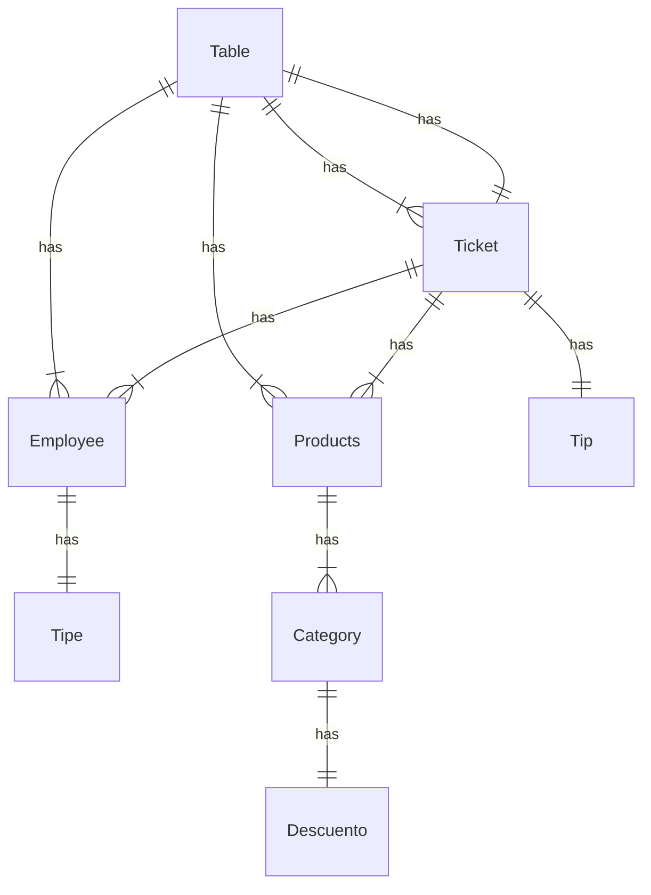

# table-admin-backend
## Proyecto en desarrollo...

El proyecto tiene como objetivo crear una aplicacion
web para la administracion de las mesas de un restaurant,
su consumo total, productos agregados a las mesas,
trabajador encargado de la mesa, etc, luego ser
capaces de generar una boleta, con el monto total,
propina y detalle de los productos consumidos. 
## Tecnologias
- Python
- Django
- Django Rest Framework
- PostgreSQL (en un futuro)
- Cloud AWS

---
MER
---

## Project in development...

The project aims to create an application
website for the administration of tables in a restaurant,
your total consumption, products added to the tables,
worker in charge of the table, etc., then be
capable of generating a ticket, with the total amount,
tip and details of the products consumed.
## Technologies
-Python
-Django
- Django Rest Framework
- PostgreSQL (in the future)
- AWS Cloud

---
MER
---
