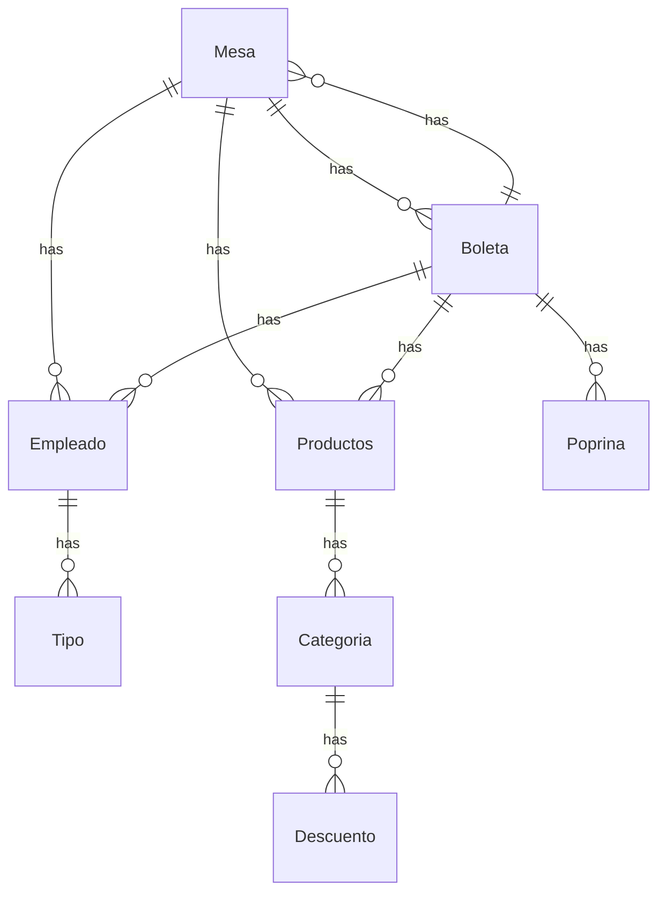

# table-admin-backend
## Proyecto en desarrollo...

El proyecto tiene como objetivo crear una aplicacion
web para la administracion de las mesas de un restaurant,
su consumo total, productos agregados a las mesas,
trabajador encargado de la mesa, etc, luego ser
capaces de generar una boleta, con el monto total,
propina y detalle de los productos consumidos. 

---
MER
---

